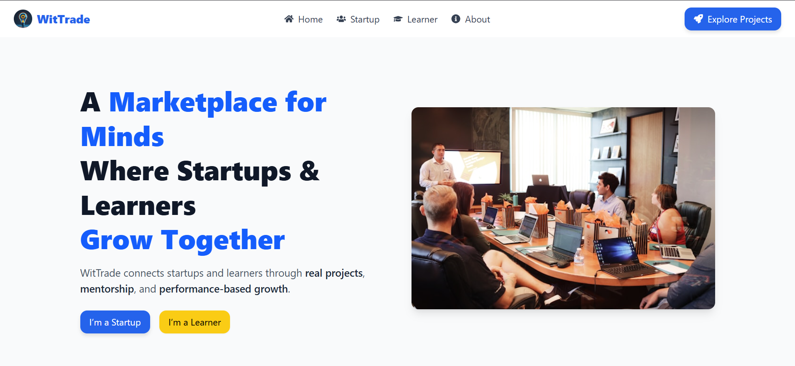
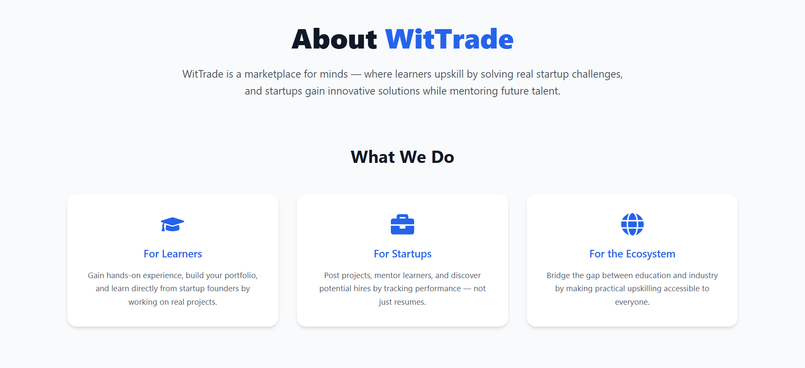
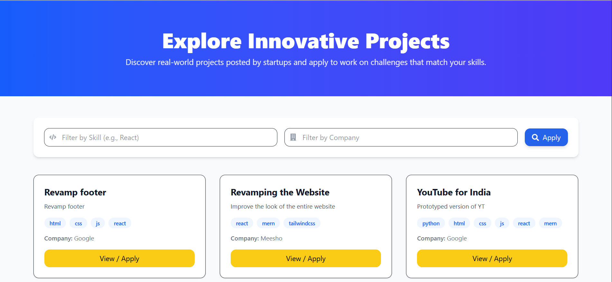

# WitTrade – A Marketplace for Minds  
🏆 *Top 6 Finalist at Hack Quanta 36-hour Hackathon (JIMS, Greater Noida x Geek Room)*  

**"A Marketplace for Minds – Where Startups and Learners Grow Together"**

---

## 🚀 Problem We’re Solving
- ❌ Startups spend time and resources onboarding interns who lack relevant skills.  
- ❌ Learners rely on generic YouTube/Udemy courses that don’t match real-world startup needs.  
- ❌ No transparent, scalable system exists that connects startups with learners for **practical, niche upskilling**.  

---

## 💡 Our Solution
**WitTrade** is a **startup-led, performance-driven knowledge marketplace**.  
- Startups design **short, project-based sessions** aligned to their unique requirements.  
- Learners **choose, learn, and prove themselves** by completing modules and projects.  
- Every learner’s growth is tracked in a **Skill Wallet** (verifiable performance history) (not implemented).  
- Hiring decisions are based on **actual performance**, not just resumes.  

---

## 🔑 Key Features
- 🖥️ **Startup Dashboard** – Post skill requirements, projects, and sessions.  
- 📊 **Learner Dashboard** – Track sessions attended, projects completed, performance score.  
- 🤝 **Knowledge Barter (Add-On)** – Peer-to-peer mentoring using credits.  (not implemented)
- 🎙️ **Rent-a-Speaker** – Startups can bring in expert speakers for short impactful sessions.  (not implemented)
- 🏆 **Performance-to-Placement** – Structured hiring based on verified growth.  

---

## 💰 Revenue Model
- **Money-Back Guarantee** – Startups pay a small fee, refunded if they actively conduct training.  
- **Placement Commission** – Platform earns when learners are hired.  
- **Freemium Model** – Free access for learners, with paid certifications/advanced versions.  
- **Rent-a-Speaker** – Monetization via external expert sessions.  

---

## 🔥 Why WitTrade is Unique
| WitTrade | Internships | YouTube/Udemy |
|----------|-------------|---------------|
| Two-way knowledge exchange | One-way work | One-way learning |
| Bite-sized, project-based | Long-term, unstructured | Generic, non-contextual |
| Resume-based matching | Limited exposure | No personalization |
| Performance-to-placement | Often unpaid | Only theory |
| Refundable startup model | No refund | Paid/free static |

👉 **In short:**  
*Internships = cheap labor. YouTube = passive learning. WitTrade = structured growth + transparent performance tracking.*  

---

## 🛠️ Tech Stack
- **Frontend:** React.js, Tailwind CSS, React Router  
- **Backend:** Node.js, Express.js
- **Database:** PostgreSQL / MongoDB  
- **Authentication:** JWT  

---

## 🔄 Workflow

### For Learners
1. Create profile & upload resume.  
2. Select startup projects/courses of interest.  
3. Attend short modules & complete micro-projects.  
4. Build **Skill Wallet** (attendance, progress, feedback).  
5. Get hired directly based on performance.  

### For Startups
1. Register on the platform (small refundable fee).  
2. List required skills and create short training modules.  
3. Host micro-sessions or upload content.  
4. Track learners’ growth via dashboards.  
5. Hire top performers directly.  

---

## 🏆 Hackathon Recognition
- Built at **Hack Quanta 36-hour Hackathon (JIMS, Greater Noida x Geek Room)**  
- **Top 6 Finalist** out of all participating teams 🎉  
- Validated by judges & mentors as **innovative and impactful** for the problem statement *“Startup Upskill Hub: Bridging Tech Gaps”*.  

---

## 👨‍💻 Team Roles
- **Backend & API Development** – Scalable architecture  
- **Frontend Development** – Dashboards & UI/UX  
- **Business Strategy** – Revenue & sustainability models  
- **Design & Pitch** – Presentations, storytelling  

---

## ⚡ Future Vision
- Blockchain-based **Skill Wallets** for tamper-proof verification.  
- AI-powered **recommendation engine** for learner-startup matchmaking.  
- Expansion to **university-incubator collaborations**.  
- Global marketplace for startups and learners across borders.  

---

## ❓ FAQs

**Q: Isn’t this just like unpaid internships?**  
👉 No. Internships = cheap labor, often unstructured. WitTrade = structured micro-learning, transparent tracking, and verifiable growth.  

**Q: Why would startups join?**  
👉 They save onboarding time, get pre-trained talent, and risk nothing (money-back guarantee).  

**Q: Why would learners join?**  
👉 They get **real startup projects**, feedback, and direct hiring opportunities, unlike generic courses.  

**Q: How does the platform earn?**  
👉 Through freemium access, certifications, placement commissions, and Rent-a-Speaker sessions.  

---

## 📸 Screenshots / Demo

### Landing Page


---
### About Page


---
### Explore Page


---

## 📥 Clone This Repository

```bash
  # Fork and clone the repo
  git clone https://github.com/aryandas2911/WitTrade.git
  
  # Navigate into project folder
  cd wittrade
  
  # Install dependencies
  npm install   # for frontend/backend separately
  
  # Start the development servers
  npm run dev
```

---

## 🤝 Contribution Guide

We welcome all contributions that help improve **WitTrade – A Marketplace for Minds** 🚀  

### 📌 How to Contribute
1. **Fork** this repository to your own GitHub account.  
2. **Clone** the forked repo to your local machine:  
   ```bash
   git clone https://github.com/<your-username>/wittrade.git
   ```
3. Create a new branch for your feature or fix:
   ```
   git checkout -b feature-name
   ```
4. Make your changes and commit them with a meaningful message:
   ```
   git commit -m "Add: feature-name (short description)"
   ```
5. Push your branch to GitHub:
   ```
   git push origin feature-name
   ```
6. Open a Pull Request on the main repository with details of your changes.
